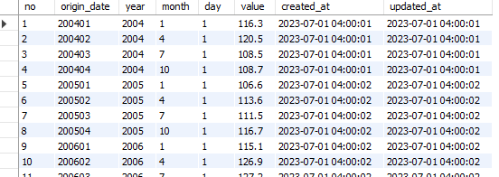

# 1. 프로젝트 개요 (Desciption)

## 1.1. 기능

부동산과 관련된 많은 데이터를 여기 정부 기관의 OpenAPI를 통해 받아오고, 이를 DB에 한 차례 저장한 뒤 이것을 프론트엔드에 서빙한다.

저장한 데이터를 사용하기 때문에, 새로 추가되는 데이터가 자동으로 받아와지지 않으므로, 스케줄 기능을 통해 매일 야간 원출처로부터 새로운 데이터가 있는지를 확인하고 변동사항을 저장한다.

데이터가 추가되었거나, 데이터의 수치가 관리자가 사전에 지정한 어느 수준에 이르게되면 자동으로 사용자들에게 알림 이메일을 발송한다.

## 1.2. 성능 및 보안

JWT인증 및 인가 방식을 통해, 비 인가자의 접근을 제한한다. refesh토큰값을 로그인 시 DB에 저장해두고, access토큰이 만기 됐을 시 브라우저에 저장되어있는 refesh토큰을 이 값과 비교하여 일치할 시 access토큰을 재발급한다. 이러한 방식을 사용하기 때문에 여러 디바이스로 동시접속을 할 경우에는 먼저 접속한 디바이스는 access토큰이 유효한 시간동안만 사용이 가능하고 이후로는 인가가 거부된다.

<br/>
<br/>
<br/>

# 2. 프로젝트 구성

## 2.1. 기술 스택

<br/>
<div align="center">
<div>


</div>

<div>

</div>

<div>

</div>

</div>

<br/>
<br/>

# 3. 실행환경 (Environment)

## 배포 : https://reloading.co.kr

<br/>

## 개발 환경 : yarn bulid

```
$ yarn
$ yarn start
```

<br/>
<br/>

# 4. 핵심 로직

## 4.1. 일일 단위 데이터 업데이트 : OpenAPI를 통해 데이터를 받아와 데이터베이스에 저장.

OpenAPI를 통해 데이터를 받아와 바로 프론트엔드에 제공하게 될 경우, 항상 최신의 데이터를 받아옴으로 데이터 최신성은 보장되지만, 전체 데이터가 너무 무거워 응답 속도가 느린 데이터도 있기 때문에 그댁로 서빙할 경우 로딩이 매우 길게 나타나 불편한 사용자 경험을 제공합니다. 때문에 이러한 단점을 보완하기 위해 DB에 한차레 저장한 후 데이터 서빙합니다.

다만, 최신성이 떨어지게 되므로 이를 보완하기 위해서 스케줄 기능을 통해 매일 야간 원출처로부터 새로운 데이터가 있는지를 자동으로 확인하고 변경사항을 반영합니다.

데이터를 저장해서 사용할 경우 한가지 장점이 생깁니다. 이전 데이터와 새 데이터가 비교가 가능하진다는 것입니다. 이로써 데이터가 변화하는 것을 감지할 수 있게되고, 이는 사용자에게 데이터 업데이트 여부에 대한 정보를 전달할 수 있게됩니다.

```js
const jobUpdateBaseRateKorea = schedule.scheduleJob(updateRule, function () {
  console.log("현재시간 02시 00분 한국 기준금리 데이터 최신화를 진행합니다.");
  try {
    // DB의 가장 최신 데이터의 날짜와 값 가져오기
    const checkSqlQuery =
      "SELECT origin_date,value FROM base_rate_korea WHERE no = (SELECT MAX(no) FROM base_rate_korea);";
    db.query(checkSqlQuery, async (err, result) => {
      if (err) console.log("DB 정보를 불러올 수 없음", err);

      // 비교하기 편하게 객체 형태로 파싱
      const latestDataDb = {
        date: result[0].origin_date,
        value: result[0].value,
      };

      // api에서 데이터 받아옴
      axios
        .get(
          `https://ecos.bok.or.kr/api/StatisticSearch/${ECOS_KEY}/json/kr/1/1000/722Y001/M/200312/203012/0101000`
        )
        .then((response) => {
          const filteredData = response.data.StatisticSearch.row.map(
            (item) => ({
              date: item.TIME,
              value: parseFloat(item.DATA_VALUE), // 이 api는 값은 문자열 형태로 줘서 그냥 할당할 시 버그가 발생한다.
            })
          );

          // 그중에서 가장 최신 값 가져오기
          const latestDataApi = filteredData[filteredData.length - 1];

          // 날짜가 일치하면 값까지 같은지 확인한다음 같으면 통과, 다르면 update문 실행.
          // value까지 비교하는 이유는 몇몇 api에서 가장 최신 값의 변경되는 경우가 있기 때문.
          if (latestDataApi.date === latestDataDb.date) {
            if (latestDataApi.value === latestDataDb.value) {
              console.log("한국 기준금리 : 현재 DB는 최신 상태 입니다. ");
            } else {
              const updateSqlQuery = `UPDATE base_rate_korea SET value = ? WHERE origin_date = ?`;
              db.query(
                updateSqlQuery,
                [latestDataApi.value, latestDataApi.date],
                (err, result) => {
                  if (err) return console.log(err);
                  //=====================================================================
                  const message = "한국 기준금리 : 최근 일자 데이터 변동";
                  const notificationQuery = `INSERT INTO data_update_logs (message,update_type) VALUES (?,?);`;
                  db.query(
                    notificationQuery,
                    [message, "modify"],
                    (err, result) => {
                      if (err)
                        return console.log(
                          "업데이트 공지 테이블에 추가하지 못했습니다."
                        );
                      console.log(
                        "한국 기준금리 : 데이터에 변경사항이 감지되어 DB를 수정하였습니다."
                      );
                    }
                  );
                  //=====================================================================
                }
              );
            }
          } else {
            // 날짜가 일치하지 않으면 새로운 데이터가 생선된 것이므로 insertans 실행
            const year = latestDataApi.date.slice(0, 4);
            const month = latestDataApi.date.slice(4, 6);
            const day = 1;
            const insertSqlQuery =
              "INSERT INTO base_rate_korea(origin_date,year,month,day,value) VALUES(?,?,?,?,?);";
            db.query(
              insertSqlQuery,
              [latestDataApi.date, year, month, day, latestDataApi.value],
              (err, result) => {
                if (err) return console.log(err);
                //========================================================================
                const message = "한국 기준금리 : 최신 데이터 추가";
                const notificationQuery = `INSERT INTO data_update_logs (message,update_type) VALUES (?,?);`;
                db.query(notificationQuery, [message, "add"], (err, result) => {
                  if (err)
                    return console.log(
                      "업데이트 공지 테이블에 추가하지 못했습니다."
                    );
                  console.log(
                    "한국 기준금리 : 새로운 데이터가 감지되어 DB에 추가하였습니다."
                  );
                });
                //========================================================================
              }
            );
          }
        });
    });
  } catch (error) {
    console.log("axios 에러", error);
  }
});

module.exports = jobUpdateBaseRateKorea;
```

<br/>

## 4.2. 주 단위 전체 데이터 리패치

몇가지 데이터에서 가장 최근 데이터가 아닌 이전의 데이터가 변경되는 현상이 발견되었습니다. 미세한 차이지만 데이터의 신뢰도를 떨어뜨릴 수 있기 때문에 일주일에 한번 토요일 새벽시간을 이용해 전체 데이터를 삭제해고 전부 새로운 데이터로 교체하는 스케줄을 진행합니다.

```js
const jobRefetchBaseRateKorea = schedule.scheduleJob(refetchRule, function () {
  console.log(
    "현재시간 토요일 04시 00분 한국 기준금리 데이터 리패치를 진행합니다."
  );
  try {
    axios
      .get(
        `https://ecos.bok.or.kr/api/StatisticSearch/${ECOS_KEY}/json/kr/1/1000/722Y001/M/200312/203012/0101000`
      )
      .then((response) => {
        const truncateQuery = `TRUNCATE base_rate_korea;`;
        db.query(truncateQuery, (err, result) => {
          if (err)
            return console.log("한국 기준금리 : TRUCATE에 실패 했습니다.");
          console.log(
            "한국 기준금리 : TRUCATE성공, 새 데이터 추가를 진행합니다."
          );

          let insertCount = 0;

          for (const item of response.data.StatisticSearch.row) {
            const originDate = item.TIME;
            const year = item.TIME.slice(0, 4);
            const month = item.TIME.slice(4, 6);
            const day = 1;
            const value = item.DATA_VALUE;
            //========================================================================================
            const sqlQuery =
              "INSERT INTO base_rate_korea(origin_date,year,month,day,value) VALUES(?,?,?,?,?);";
            db.query(
              sqlQuery,
              [originDate, year, month, day, value],
              (err, result) => {
                if (err)
                  return console.log(
                    "한국 기준금리 : 새 데이터 추가에 실패 했습니다."
                  );

                insertCount++;

                // 모든 데이터 추가 완료 후에 실행할 코드
                if (insertCount === response.data.StatisticSearch.row.length) {
                  //=====================================================================================
                  const message =
                    "한국 기준금리 : 모든 데이터를 새 데이터로 교체 완료";
                  const notificationQuery = `INSERT INTO data_update_logs (message,update_type) VALUES (?,?);`;
                  db.query(
                    notificationQuery,
                    [message, "refetch"],
                    (err, result) => {
                      if (err)
                        return console.log(
                          "한국 기준금리 : 업데이트 공지 테이블에 추가하지 못했습니다."
                        );
                      console.log(
                        "한국 기준금리 : 새 데이터로 교체 완료하였습니다."
                      );
                    }
                  );
                  //=====================================================================================
                }
              }
            );
            //========================================================================================
          }
        });
      })
      .catch((error) => {
        console.log(error);
        // res.status(500).send(error.message);
      });
  } catch (error) {
    console.log("axios 에러", error);
  }
});

module.exports = jobRefetchBaseRateKorea;
```

```js
/* OnlyBestList.jsx*/

// best 태그가 체크되어있는 상품만 골라 배열 생성 (getOnlyNew와 코드 동일)
let bestThings = [];

products &&
  products.map((item) => {
    bestThings.push(
      //다중 중첩된 객체에서 조건에 맞는 상품만 골라내기
      Object.values(item).filter(
        (thing) => thing.tags && thing.tags.best && thing.tags.best === true
      )
    );
    return bestThings; // 오류 안 생기는지 잘 확인
  });
```

<br/>

# 4.3 데이터 파싱

데이터는 다양한 출처로부터 가져오므로 포맷이 다 다릅니다. 이 데이터를 효율적으로 사용하기 위해서든 데이터를 파싱하여 단일한 포맷으로 데이터베이스에 저장하는 것이 중요합니다. 데이터는 아래와 같은 테이블 구조로 저장됩니다.
날짜는 원래의 날짜와 년,월,일을 각각 저장합니다. 원래의 날짜로는 데이터를 비교할 때 사용되며, 각각 저장된 날짜는 추후 기능이 추가되었을 시 날짜별로 데이터를 조회할 수 있도록 하였습니다.



<br/>

# 4.4 업데이트 이메일 발송

매일 오전 7시 야간의 데이터 업데이트 유뮤를 확인하고, 업데이트 사항이 있으면 해당 내역을 이메일 알림 서비스를 신청한 사용자에게 메일을 전송합니다.

```js
const sendEmailRule = new schedule.RecurrenceRule();
// rule.dayOfWeek = [1]; // 0:일 1:월 2:화 3:수 4:목 5:금  6:토
sendEmailRule.hour = 7;
sendEmailRule.minute = 0;
//===========================================================================================
//job================================================================================

const executeScheduledSendEmail = () => {
  console.log(
    "업데이트 데이터 알림 메일 전송 작업이 정상적으로 실행되었습니다. "
  );

  const jobSendUpdateEmail = schedule.scheduleJob(sendEmailRule, function () {
    console.log(
      "현재시간 07시 00분 업데이트 데이터 알림 메일 전송을 시작합니다. "
    );
    try {
      //=================================================

      // 오늘 일자에 업데이트된 내용이 있는지 확인하고 있으면 메일전송
      const checkSqlQuery =
        "SELECT * FROM data_update_logs WHERE update_type <> 'refetch'";
      db.query(checkSqlQuery, async (err, result) => {
        if (err) return console.log("DB 정보를 불러올 수 없음", err);

        const currentDate = new Date().toLocaleDateString("ko-KR");

        const todayUpdatedList = result.filter((item) => {
          return item.created_at.toLocaleDateString("ko-KR") === currentDate;
        });

        if (todayUpdatedList.length === 0) {
          return console.log(
            "업데이트된 데이터가 없습니다. 스케줄을 종료합니다."
          );
        } else {
          //=============================================================================================================

          //==============================================
          const userListSqlQuery =
            "SELECT nickname, email FROM users WHERE email_service_enabled = TRUE;";
          db.query(userListSqlQuery, async (err, result) => {
            if (err) return console.log("DB 정보를 불러올 수 없음", err);

            const emailRecipients = result.reduce((acc, cur) => {
              acc.push(cur.email);
              return acc;
            }, []);

            //==========================================
            // SMTP 전송 설정
            const transporter = nodemailer.createTransport({
              host: "smtp.gmail.com",
              auth: {
                user: process.env.SMTP_USER,
                pass: process.env.SMTP_PASS,
              },
            });
            //============================================
            // 이메일 전송
            const generateVerificationCodeAndSendEmail = async () => {
              await sendEmail(emailRecipients, todayUpdatedList);
            };

            // 이메일 전송 함수
            const sendEmail = async (emailRecipients, todayUpdatedList) => {
              try {
                const mailOptions = {
                  from: process.env.SMTP_USER,
                  to: emailRecipients.join(","),
                  subject: `[RE:LOADING] ${currentDate} 데이터 업데이트 알림 서비스`,
                  // text로 할 경우 ===
                  //     text: `
                  //   ${today}의 데이터 업데이트 내역이 ${
                  //       todayUpdatedList.length
                  //     }건 있습니다.
                  //   ${todayUpdatedList.map((item) => item.message).join("<br>")}
                  // `,
                  // html로 할 경우 ===
                  html: `
                  <table style="width: 100%; max-width: 600px; margin: 0 auto;">
                  <tr>
                  <td style="text-align: center; background-color: #f5f5f5; padding-bottom: 50px; border-radius: 10px;">
                  
                      <p style="font-size:20px; line-height:50px; color: #148888; font-weight:900;">${currentDate} 일자의 데이터 업데이트 내역이 ${
                    todayUpdatedList.length
                  }건 있습니다.</p>
                      <ul>
                        ${todayUpdatedList
                          .map(
                            (item) =>
                              `<p style="font-size:15px; line-height:30px"><span style="font-weight:700; color: #148888;">${
                                item.message.split(":")[0]
                              }</span> : <span>${item.message
                                .split(":")
                                .slice(1)}</span></p>`
                          )
                          .join("")}
                      </ul>
                      <br/>
                      <br/>
                      <a href="/" style="text-align: center; padding: 10px 20px; background: #148888; border-radious:5px; color:#f5f5f5; margin:20px">RE:ROADING 으로 바로 이동하기</a>
                    </td>
                  </tr>
                </table>
            `,
                };

                const response = await transporter.sendMail(mailOptions);

                console.log("이메일이 성공적으로 전송되었습니다.", response);
                // res.status(200).json("Send Complete");
              } catch (error) {
                console.error("이메일 전송 중 오류가 발생했습니다.", error);
                // res.status(500).json(error);
              }
            };
            // 실행
            await generateVerificationCodeAndSendEmail();
          });

          //=============================================================================================================
        }
      });
    } catch (error) {
      console.log("axios 에러", error);
    }
  });
};

module.exports = executeScheduledSendEmail;
```

<br/>
<br/>

# 5. 버그

- 추가적으로 확인된 버그 없음

  <br/>
  <br/>

# 6. 향후 발전사항

- 회원탈퇴 기능 구현
- 차트 마다 댓글란을 구현하여 회원끼리 소통할 수 있도록 개선.
- 알림 메일을 '조건 충족 여부'만 받을지,'데이터 업데이트 여부'까지 받을 지 선택할 수 있도록 개선.
- 시장 분위기 파악 게이지 차트 개설.
  <br/>
  <br/>

# 7. 프로그램 작성자 및 도움을 준 사람

- 방충림 (개인프로젝트)
  <br/>
  <br/>

# 8. 버전 (업데이트 소식)

- 0.1.2 - 회원 가입 관련 버그 수정 ( 2023.07.01 )
- 0.1.1 - 개발단계 버그 수정 테스트 릴리즈 ( 2023.06.04 )
- 0.1.0 - 개발단계 테스트 릴리즈 ( 2023.06.03 )

  <br/>
  <br/>

# 9. 저작권 및 사용권 정보

- 참고용 유튜브 동영상돠 차트해석 인사이트의 저작권은 (주)월급쟁이 부자들 에 있습니다.
  <br/>
  <br/>
